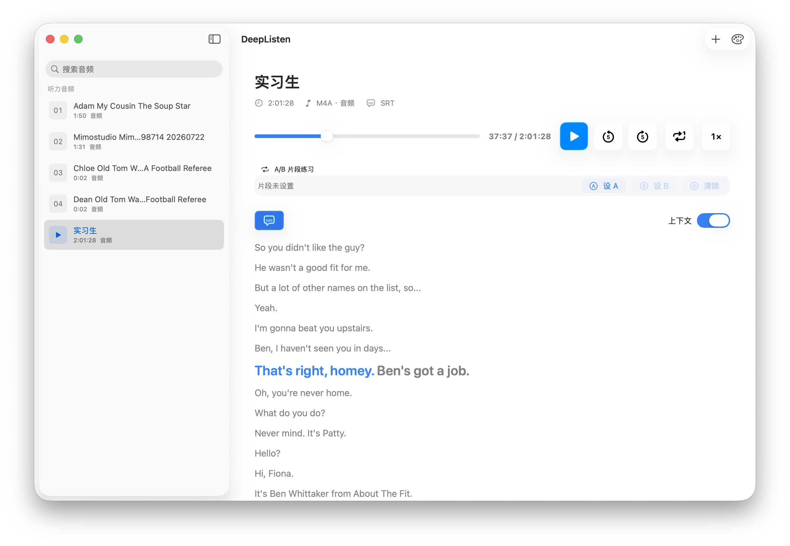

# DeepListen

**简体中文** | [English](README.en.md)

一款专为英语精听训练设计的原生 macOS 播放器。导入本地音频、视频和同名字幕，即可使用逐词高亮、全文稿、倍速播放及 A/B 循环反复练习。

[](https://github.com/swiftczz/DeepListen/releases/latest)


## 界面预览



## 核心功能

### 媒体库

- 拖入文件或文件夹，也可通过工具栏或 Finder 打开音视频
- 递归扫描文件夹，跳过隐藏文件，并按文件名自然排序
- 支持拖拽排序、搜索、多选删除及「在访达中显示」
- 自动去重并持久化媒体库、手动顺序、曲目时长和当前选中项
- 支持格式：`mp3` `m4a` `aac` `wav` `aiff` `aif` `caf` `flac` `mp4` `m4v` `mov` `avi` `mkv`

### 字幕精听

- 自动匹配与媒体文件**同名**的 `.srt` / `.SRT` 或 `.vtt` / `.VTT` 字幕
- 支持 UTF-8、UTF-16、GB18030 和 ISO-Latin1 编码
- 自动清理字幕中的 HTML 标签，并按时间重新排序
- 当前字幕根据播放进度逐词高亮；普通字幕没有逐词时间戳时，会按整句时长估算进度
- 可在「当前句」与「全文上下文」之间切换，点击任意字幕即可跳转
- 全文稿自动跟随当前句；手动滚动后可一键恢复自动跟随

### 播放控制

- 播放 / 暂停、前进 / 后退 5 秒，以及进度条精确定位和悬停时间预览
- 0.25x–2.0x 倍速播放，步进 0.25x
- 顺序播放与单曲循环，自动保存倍速和播放模式
- 支持 macOS 系统媒体控制、上一首 / 下一首和 5 秒快进 / 快退

### A/B 片段练习

- 在当前位置设置 A 点和 B 点
- 时间轴显示片段标记及高亮区间
- 播放到 B 点后自动跳回 A 点，也可随时清除片段

### 原生界面

- 9 种主题色：系统、蓝、紫、粉、红、橙、黄、绿、石墨
- 主题色和字幕显示偏好自动保存
- 自适应窄窗口布局，空间不足时自动收起侧边栏
- 针对 VoiceOver、键盘导航和 macOS Liquid Glass 进行适配

## 安装

1. 前往 [Releases](https://github.com/swiftczz/DeepListen/releases/latest) 下载对应架构或 universal 版本的 DMG。
2. 打开 DMG，将 `DeepListen.app` 拖入「应用程序」。
3. 首次启动时右键应用并选择「打开」。

发布包使用 Ad-hoc 签名。如果 Gatekeeper 仍然阻止启动，可在终端执行：

```bash
xattr -dr com.apple.quarantine /Applications/DeepListen.app
```

## 快速开始

1. 点击工具栏中的 `+`，或将媒体文件 / 文件夹拖入窗口。
2. 如需字幕，把字幕与媒体放在同一目录并使用相同的主文件名。
3. 选择曲目后开始播放，通过字幕、倍速和 A/B 循环进行精听。

## 快捷键

| 快捷键 | 功能 |
| --- | --- |
| `Space` | 播放 / 暂停 |
| `←` | 后退 5 秒 |
| `→` | 前进 5 秒 |
| `⌘⇧←` | 上一首 |
| `⌘⇧→` | 下一首 |
| `⌘⌥←` | 后退 5 秒 |
| `⌘⌥→` | 前进 5 秒 |
| `⌘⌥A` | 设置 A 点 |
| `⌘⌥B` | 设置 B 点 |
| `⌘⌥Esc` | 清除 A/B 片段 |
| `⌘⌥S` | 显示 / 隐藏字幕 |

在搜索框或其他文本输入区域编辑时，无修饰键的播放快捷键不会触发。

## 字幕匹配规则

字幕文件必须与媒体文件位于同一目录，并使用相同的主文件名：

```text
我的素材/
├── Lesson 01.mp3
├── Lesson 01.srt      ← 自动匹配
├── Lesson 02.mp4
└── Lesson 02.vtt      ← 自动匹配
```

应用会在每次载入曲目时重新查找字幕，因此可以先导入媒体，再补充字幕文件。

## 从源码构建

### 环境要求

- macOS 26.0 或更高版本
- Swift 6.3 工具链

### 编译与运行

若需要生成 `.app`、注册 LaunchServices 并启动应用，可使用项目脚本：

```bash
./script/build_and_run.sh
```

其他开发模式：

| 命令 | 用途 |
| --- | --- |
| `./script/build_and_run.sh --debug` | 构建并在 LLDB 中调试 |
| `./script/build_and_run.sh --logs` | 启动并跟踪进程日志 |
| `./script/build_and_run.sh --telemetry` | 启动并跟踪应用 subsystem 日志 |
| `./script/build_and_run.sh --verify` | 启动并验证进程是否存活 |

### 打包 DMG

```bash
APP_VERSION=0.8.0 ./script/build_and_run.sh --build-only universal --sign --dmg
APP_VERSION=0.8.0 ./script/build_and_run.sh --build-only arm64     --sign --dmg
APP_VERSION=0.8.0 ./script/build_and_run.sh --build-only x86_64    --sign --dmg
```

- `--build-only <arch>`：使用 release 配置构建 `universal`、`arm64` 或 `x86_64`
- `--sign`：对 `.app` 进行 Ad-hoc 签名
- `--dmg`：在 `dist/` 生成 `DeepListen-<arch>-<version>.dmg`
- `APP_VERSION`：写入 `Info.plist` 和 DMG 文件名；未设置时依次使用最新 Git Tag 或 `0.0.0-dev`

## 技术栈

- **SwiftUI**：界面与交互
- **AVFoundation**：媒体播放与时长解析
- **MediaPlayer**：系统媒体控制与正在播放信息
- **Observation**：`@Observable` 状态管理
- **Swift Package Manager**：构建与依赖管理

## 项目结构

```text
DeepListen/
├── .github/workflows/
│   └── release.yml          # Tag 触发的 DMG 发布流程
├── docs/images/             # README 图片资源
├── Resources/
│   └── AppIcon.icns
├── script/
│   ├── build_and_run.sh     # 本地运行与打包
│   └── generate_changelog.sh
├── Sources/DeepListen/
│   ├── App/                 # 应用入口与菜单命令
│   ├── Models/              # 音轨、字幕、播放模式与主题
│   ├── Services/            # 媒体发现、Finder 与系统媒体能力
│   ├── Stores/              # 播放状态与媒体库
│   ├── Support/             # 字幕解析与时间格式化
│   └── Views/               # SwiftUI 视图
└── Package.swift
```

## 许可证

本项目目前用于个人学习，尚未指定开源许可证。
